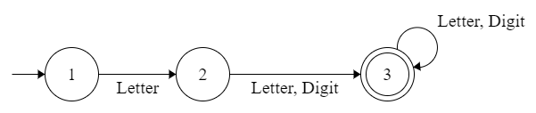
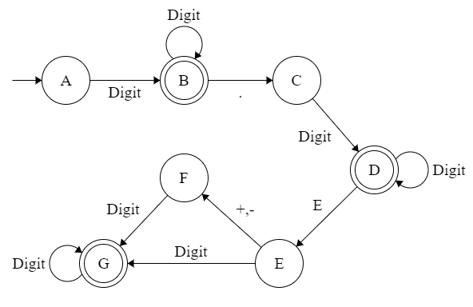
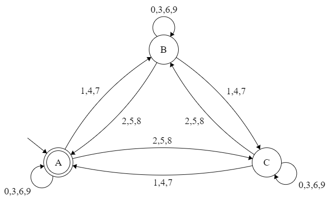
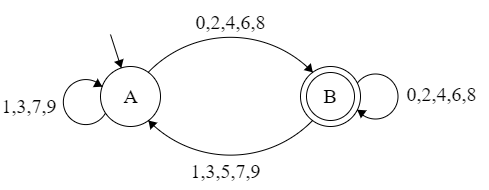

# automata-exercises
Exercises in the theory of automata and formal languages. [Code here](src)

## Exercise 1 - Letter [ Letter | Digit ] [ Letter | Digit ]*

## Exercise 2 - Digit Digit* [ . Digit Digit* [ E [ + | - ] Digit Digit*] ]

## Exercise 3 - Divisible by 3

## Exercise 4 - Even number, divisible by 2

